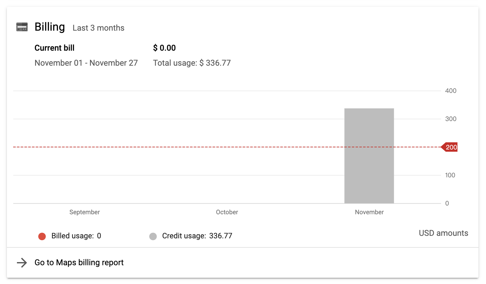
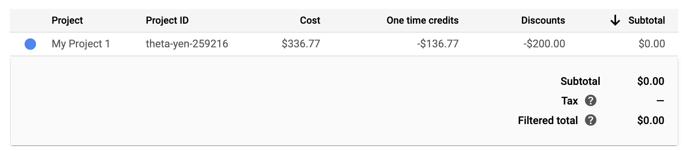
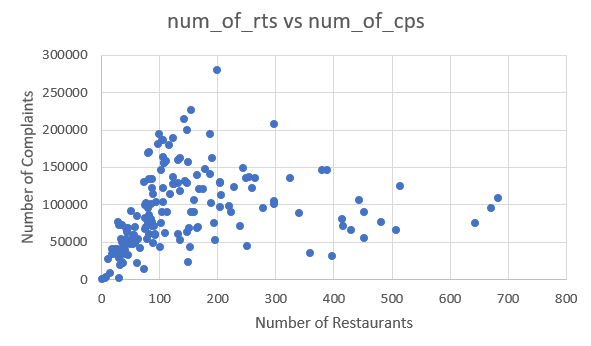
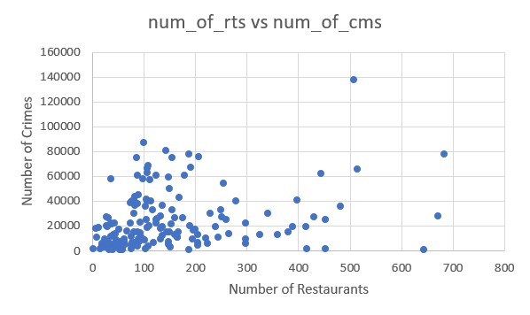
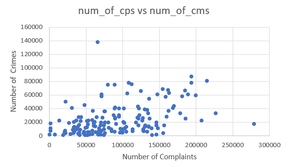
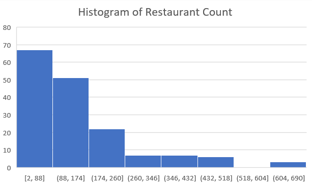
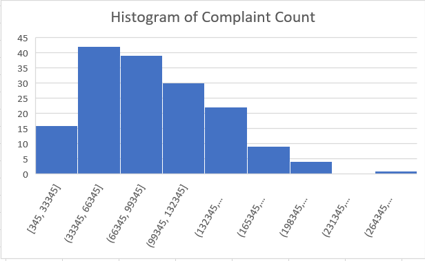
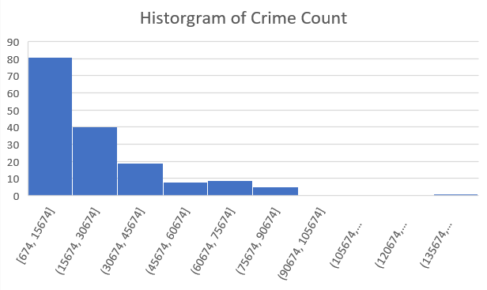

# Realtime Big Data - Final Project

The following commands are executed in the working directory (this project path)

 

## Data Ingest Stage

### The Steps of 311 Data Ingest

1. Login to Dumbo.
2. Download the dataset (csv format) through the URL:  
   `curl -O https://nycopendata.socrata.com/api/views/erm2-nwe9/rows.csv?accessType=DOWNLOAD`
3. Make a new directory in HDFS:  
   `hdfs dfs -mkdir /user/<your netid>/project`
4. Put the dataset file into HDFS:  
   `hdfs dfs -put 311_Service_Requests_from_2010_to_Present.csv /user/<your netid>/project`

 

### The Steps of Restaurant Data Ingest

1. Log on to Dumbo.
2. Dowload the DOHMH New York City Restaurant Inspection Results dataset (tsv format).  
   `curl -O https://data.cityofnewyork.us/api/views/43nn-pn8j/rows.tsv?accessType=DOWNLOAD&bom=true`
3. Make a new directory in HDFS.  
   `hdfs dfs -mkdir /user/<your netid>/project/dataset`
4. Put the dataset file into HDFS.  
   `hdfs dfs -put rst.tsv /user/<your netid>/project/dataset`

or, simply execute `DataIngest.sh` in the folder `data_ingest/restaurant_data`.  
`./data_ingest/restaurant_data/DataIngest.sh`

 

### The Steps of Crime Data Ingest

1. Login to Dumbo.
2. Download the dataset (csv format) through the URL.  
   `curl -O https://data.cityofnewyork.us/api/views/8h9b-rp9u/rows.csv?accessType=DOWNLOAD`
3. Change the file name to a shorter one.  
   `mv rows.csv?accessType=DOWNLOAD rows.csv`
4. Make a new directory in HDFS.  
   `hdfs dfs -mkdir /user/<your netid>/project`
5. Put the dataset file into HDFS.  
   `hdfs dfs -put rows.csv /user/<your netid>/project`

  

## ETL Stage

 

## 1. 311 Data

### The Steps of 311 Data Cleaning

1. Go to the directory.  
   `cd etl_code/311_data/data_cleaning`
2. Clean the 311 dataset.  
   `hadoop jar CleaningDriver.jar CleaningDriver /user/<your netid>/project/311_Service_Requests_from_2010_to_Present.csv /user/<your netid>/project/311_cleaned`

 

### 311 Data Schema

| Column name    | Type   | Description                                 | Valid length |
| -------------- | ------ | ------------------------------------------- | ------------ |
| Time           | String | The time that the complaint took place      | 22           |
| Complaint Type | String | The type of complaint                       | 1 - 39       |
| Zipcode        | String | The zipcode that the complaint fell in      | 1 - 43       |
| Latitude       | Double | The latitude that the complaint took place  |              |
| Longitude      | Double | The longitude that the complaint took place |              |

 

### Phase 1 - Count the complaint data for different zip code's areas (analytics purpose)

1. Go to the directory.  
   `cd etl_code/311_data/complaint_count_by_zipcode`
2. Generate the count of complaint by zipcode.  
   `hadoop jar ZipcodeCountDriver.jar ZipcodeCountDriver /user/<your netid>/project/311_cleaned /user/<your netid>/project/311_complaint_count_by_zipcode`

 

### 311 Data Schema (Phase 1)

| Column name | Type   |
| ----------- | ------ |
| Zipcode     | String |
| Count       | Long   |

 

### Phase 2 - Count the complaint data for different complaint types in each zip code area (analytics purpose)

1. Go to the directory.  
   `cd etl_code/311_data/complaint_types_count_by_zipcode`
2. Generate the count of complaint types by zipcode.  
   `hadoop jar ComplaintTypeCountDriver.jar ComplaintTypeCountDriver /user/<your netid>/project/311_cleaned /user/<your netid>/project/311_complaint_type_count_by_zipcode`

 

### 311 Data Schema (Phase 2)

| Column name   | Type   |
| ------------- | ------ |
| Zipcode       | String |
| ComplaintType | String |
| Count         | String |

  

## 2. Restaurant Data

### The Steps of Restaurant Data Cleaning

1. Go to the data cleaning directory.  
   `cd etl_code/restaurant_data/data_cleaning`
2. Execute `DataCleaning.sh`.  
   `./DataCleaning.sh`
3. Check the data cleaning code is run successfully.  
   `hdfs dfs -ls /user/jl11046/Final/phase0/ETL/DataCleaningOutput`

 

### Restaurant Data Schema

| Column name | Type   | Description                           | Valid length |
| ----------- | ------ | ------------------------------------- | ------------ |
| CAMIS       | String | Unique identifier for the restaurant. | 8            |
| BORO        | String | Borough of restaurant location.       |              |
| CUISINE     | String | Restaurant cuisine.                   |              |
| LATITUDE    | Double | Restaurant latitude.                  | 12 - 15      |
| LONGITUDE   | Double | Restaurant longitude.                 | 12 - 16      |

 

### Phase 1 - Count the restaurant data for different zip code's areas (analytics purpose)

1. Go to the ETL directory.  
   `cd code_iterations/phase1/ETL`
2. Construct table of restaurants needed for analytic phase1.  
   `./DataCleaning.sh`
3. Go to the Join directory.  
   `cd code_iterations/phase1/Join`
4. Join restaurant table, 311 table, crime table.  
   `./JoinTables.sh`
5. Go to the linear regression directory.  
   `cd code_iterations/phase1/LinearRegression`
6. Run simple linear regression on the joined data.  
   `./execute.sh`
7. Check simple linear regression output.  
   `hdfs dfs -cat /user/jl11046/Final/phase1/LR/output/*`

 

### Restaurant Data Schema (Phase 1)

| Column name | Type   |
| ----------- | ------ |
| zipcode     | String |
| num_of_rts  | Bigint |

### Joined Data Schema (Phase 1)

| Column name | Type   |
| ----------- | ------ |
| zipcode     | String |
| num_of_rts  | Bigint |
| num_of_cps  | Bigint |
| num_of_cms  | Bigint |

 

### Phase 2 - Count the restaurant data for different restaurant types in each zip code area (analytics purpose)

1. Go to the ETL directory.  
   `cd code_iterations/phase2/ETL`
2. Construct table of restaurants needed for analytic phase2.  
   `./ConstructTables.sh`
3. Go to the Join directory.  
   `cd code_iterations/phase2/Join`
4. Join restaurant table, 311 table, crime table.  
   `./JoinTables.sh`
5. Go to the linear regression directory.  
   `cd code_iterations/phase2/LinearRegression`
6. Run OLS multiple linear regression on the joined data.  
   `./execute.sh`
7. Check multiple linear regression output.  
   `hdfs dfs -cat /user/jl11046/Final/phase2/LR/output/*`

 

### Restaurant Data Schema (Phase 2)

| Column name | Type   |
| ----------- | ------ |
| zipcode     | String |
| american    | Bigint |
| chinese     | Bigint |
| mexican     | Bigint |
| italian     | Bigint |
| japanese    | Bigint |

 

### Joined Data Schema (Phase 2)

| Column name  | Type   |
| ------------ | ------ |
| zipcode      | String |
| american     | Bigint |
| chinese      | Bigint |
| mexican      | Bigint |
| italian      | Bigint |
| japanese     | Bigint |
| noise        | Bigint |
| homeless     | Bigint |
| animalabuse  | Bigint |
| safety       | Bigint |
| drugactivity | Bigint |
| robbery      | Bigint |
| burglary     | Bigint |
| weapons      | Bigint |
| sexcrimes    | Bigint |
| murder       | Bigint |

 

### The references for Apache Commons Math 3.3 Linear Regression API

- https://commons.apache.org/proper/commons-math/javadocs/api-3.3/org/apache/commons/math3/stat/regression/SimpleRegression.html
- https://commons.apache.org/proper/commons-math/javadocs/api-3.0/org/apache/commons/math3/stat/regression/OLSMultipleLinearRegression.html

  

## 3. Crime Data

### The Steps of Crime Data Cleaning

1. Go to the directory.  
   `cd etl_code/crime_data/data_cleaning`
2. Remove the output folder if it exists.  
   `hdfs dfs -rm -r /user/<your netid>/project/dc_output`
3. Clean the Crime dataset.  
   `hadoop jar DataCleaning.jar DataCleaning /user/<your netid>/project/rows.csv /user/<your netid>/project/dc_output`
4. Go to the directory.  
   `cd etl_code/crime_data/zip_code_table`
5. Put the zip code table file into HDFS.  
   `hdfs dfs -put zipcode.csv /user/<your netid>/project`
6. Remove the output folder if it exists.  
   `hdfs dfs -rm -r /user/<your netid>/project/zct_output`
7. Generate the Zip Code matching table.  
   `hadoop jar ZipCodeTable.jar ZipCodeTable /user/<your netid>/project/zipcode.csv /user/<your netid>/project/zct_output`
8. Go to the directory.  
   `cd etl_code/crime_data/lon_lat_to_zip_code`
9. Remove the output folder if it exists.  
   `hdfs dfs -rm -r /user/<your netid>/project/llzc_output`
10. Turn Latitude and Longitude into Zip Code.  
    `hadoop jar LonLatToZipCode.jar LonLatToZipCode /user/<your netid>/project/dc_output/part-r-00000 /user/<your netid>/project/llzc_output`
11. Check the final dataset after the cleaning process.  
    `hdfs dfs -cat /user/<your netid>/project/llzc_output/part-r-00000`

 

### Crime Data Schema

| Column name | Type   | Description                                  | Valid length |
| ----------- | ------ | -------------------------------------------- | ------------ |
| Crime ID    | String | The unique identifier for each crime record. | 9 - 10       |
| Date        | String | The date that the arrest take place.         | 10           |
| Crime Type  | String | The type of crime.                           | 1 - 43       |
| Borough     | String | The borough that the arrest take place.      |              |
| Latitude    | Double | The latitude that the arrest take place.     | 17 - 18      |
| Longitude   | Double | The longitude that the arrest take place.    | 10 - 13, 18  |
| ZipCode     | String | The zip code that the arrest take place.     |              |

 

### Phase 1 - Count the crime data for different zip code's areas (analytics purpose)

1. Go to the directory.  
   `cd etl_code/crime_data/zip_code_count_1`
2. Remove the output folder if it exists.  
   `hdfs dfs -rm -r /user/<your netid>/project/zcc_1_output`
3. Count Crime Data in each Zip Code area.  
   `hadoop jar ZipCodeCount.jar ZipCodeCount /user/<your netid>/project/llzc_output/part-r-00000 /user/<your netid>/project/zcc_1_output`
4. Check the Phase 1 data for analytics.  
   `hdfs dfs -cat /user/<your netid>/project/zcc_1_output/part-r-00000`

 

### Crime Data Schema (Phase 1)

| Column name | Type    |
| ----------- | ------- |
| Zip Code    | String  |
| Crime Count | Integer |

 

### Phase 2 - Count the crime data for different crime types in each zip code area (analytics purpose)

1. Go to the directory.  
   `cd etl_code/crime_data/zip_code_count_2`
2. Remove the output folder if it exists.  
   `hdfs dfs -rm -r /user/<your netid>/project/zcc_2_output`
3. Count Crime Data for each Crime Type in each Zip Code area.  
   `hadoop jar ZipCodeCount2.jar ZipCodeCount2 /user/<your netid>/project/llzc_output/part-r-00000 /user/<your netid>/project/zcc_2_output`
4. Check the Phase 2 data for analytics.  
   `hdfs dfs -cat /user/<your netid>/project/zcc_2_output/part-r-00000`

 

### Crime Data Schema (Phase 2)

| Column name | Type    |
| ----------- | ------- |
| Zip Code    | String  |
| Crime Type  | String  |
| Crime Count | Integer |

 

### Phase 3 - Count the crime data for different crime types in each zip code area (crime type as a column) (analytics purpose)

1. Go to the directory.  
   `cd etl_code/crime_data/zip_code_count_3`
2. Remove the output folder if it exists.  
   `hdfs dfs -rm -r /user/<your netid>/project/zcc_3_output`
3. Get the Crime Data Counts for each Crime Type in each Zip Code area.  
   `hadoop jar ZipCodeCount3.jar ZipCodeCount3 /user/<your netid>/project/llzc_output/part-r-00000 /user/<your netid>/project/zcc_3_output`
4. Check the Phase 3 data for our analytics.  
   `hdfs dfs -cat /user/<your netid>/project/zcc_3_output/part-r-00000`

 

### Crime Data Schema (Phase 3)

| Column name                                 | Type    |
| ------------------------------------------- | ------- |
| ZIP CODE                                    | String  |
| ADMINISTRATIVE CODE                         | Integer |
| ANTICIPATORY OFFENSES                       | Integer |
| ARSON                                       | Integer |
| ASSAULT 3 & RELATED OFFENSES                | Integer |
| BURGLARY                                    | Integer |
| CRIMINAL MISCHIEF & RELATED OFFENSES        | Integer |
| CRIMINAL TRESPASS                           | Integer |
| DANGEROUS DRUGS                             | Integer |
| DANGEROUS WEAPONS                           | Integer |
| DISORDERLY CONDUCT                          | Integer |
| DISRUPTION OF A RELIGIOUS SERVICE           | Integer |
| ENDAN WELFARE INCOMP                        | Integer |
| F.C.A. P.I.N.O.S.                           | Integer |
| FELONY ASSAULT                              | Integer |
| FORCIBLE TOUCHING                           | Integer |
| FORGERY                                     | Integer |
| FRAUDS                                      | Integer |
| FRAUDULENT                                  | Integer |
| GAMBLING                                    | Integer |
| GRAND LARCENY                               | Integer |
| GRAND LARCENY OF MOTOR VEHICLE              | Integer |
| HARRASSMENT 2                               | Integer |
| HOMICIDE-NEGLIGENT-VEHICLE                  | Integer |
| INTOXICATED & IMPAIRED DRIVING              | Integer |
| KIDNAPPING & RELATED OFFENSES               | Integer |
| LOITERING                                   | Integer |
| MISCELLANEOUS PENAL LAW                     | Integer |
| MOVING INFRACTIONS                          | Integer |
| MURDER & NON-NEGL. MANSLAUGHTER             | Integer |
| NEW YORK CITY HEALTH CODE                   | Integer |
| NYS LAWS-UNCLASSIFIED FELONY                | Integer |
| OFF. AGNST PUB ORD SENSBLTY & RGHTS TO PRIV | Integer |
| OFFENSES AGAINST MARRIAGE UNCLASSIFIED      | Integer |
| OFFENSES AGAINST PUBLIC ADMINISTRATION      | Integer |
| OFFENSES AGAINST PUBLIC SAFETY              | Integer |
| OFFENSES AGAINST THE PERSON                 | Integer |
| OFFENSES INVOLVING FRAUD                    | Integer |
| OFFENSES RELATED TO CHILDREN                | Integer |
| OTHER OFFENSES RELATED TO THEFT             | Integer |
| OTHER STATE LAWS                            | Integer |
| OTHER STATE LAWS (NON PENAL LAW)            | Integer |
| OTHER TRAFFIC INFRACTION                    | Integer |
| PARKING OFFENSES                            | Integer |
| PETIT LARCENY                               | Integer |
| POSSESSION OF STOLEN PROPERTY 5             | Integer |
| PROSTITUTION & RELATED OFFENSES             | Integer |
| ROBBERY                                     | Integer |
| SEX CRIMES                                  | Integer |
| THEFT-FRAUD                                 | Integer |
| VEHICLE AND TRAFFIC LAWS                    | Integer |

  

## Data Profiling Stage

### The Steps of 311 Data Profiling

1. Go to the directory.  
   `cd profiling_code/311_data/data_profiling_type`
2. Remove the output folder if it exists.  
   `hdfs dfs -rm -r /user/<your netid>/project/311_type_profiled`
3. Profile the types in 311 dataset.  
   `hadoop jar TypeStatDriver.jar TypeStatDriver /user/<your netid>/project/311_cleaned /user/<your netid>/project/311_type_profiled`
4. Check the result of data profiling.  
   `hdfs dfs -cat /user/<your netid>/project/311_type_profiled/part-r-00000`
5. Go to the directory.  
   `cd profiling_code/311_data/data_profiling_type_len`
6. Remove the output folder if it exists.  
   `hdfs dfs -rm -r /user/<your netid>/project/311_type_len_profiled`
7. Profile the length of types in 311 dataset.  
   `hadoop jar TypeLenDriver.jar TypeLenDriver /user/<your netid>/project/311_cleaned /user/<your netid>/project/311_type_len_profiled`
8. Check the result of data profiling.  
   `hdfs dfs -cat /user/<your netid>/project/311_type_len_profiled/part-r-00000`
9. Go to the directory.  
   `cd profiling_code/311_data/data_profiling_year`
10. Remove the output folder if it exists.  
    `hdfs dfs -rm -r /user/<your netid>/project/311_year_profiled`
11. Profile the length of types in 311 dataset.  
    `hadoop jar YearStatDriver.jar YearStatDriver /user/<your netid>/project/311_cleaned /user/<your netid>/project/311_year_profiled`
12. Check the result of data profiling.  
    `hdfs dfs -cat /user/<your netid>/project/311_year_profiled/part-r-00000`

 

### The Steps of Restaurant Data Profiling
1. Go to the directory.  
   `cd profiling_code/restaurant_data/data_profiling`
2. Execute `execute.sh`.  
   `./execute.sh`
3. Check the result of data profiling.  
   `hdfs dfs -cat /user/jl11046/Final/phase0/ETL/DataProfilingOutput/*
 

### The Steps of Crime Data Profiling

1. Go to the directory.  
   `cd profiling_code/crime_data/data_profiling_1`
2. Remove the output folder if it exists.  
   `hdfs dfs -rm -r /user/<your netid>/project/dp_1_output`
3. Profile the crime dataset.  
   `hadoop jar DataProfiling.jar DataProfiling /user/<your netid>/project/rows.csv /user/<your netid>/project/dp_1_output`
4. Check the result of data profiling.  
   `hdfs dfs -cat /user/<your netid>/project/dp_1_output/part-r-00000`
5. Go to the directory.  
   `cd profiling_code/crime_data/data_profiling_2`
6. Remove the output folder if it exists.  
   `hdfs dfs -rm -r /user/<your netid>/project/dp_2_output`
7. Profile the crime dataset for checking the crime type characteristics.  
   `hadoop jar DataProfiling2.jar DataProfiling2 /user/<your netid>/project/rows.csv /user/<your netid>/project/dp_2_output`
8. Check the result of data profiling for crime type characteristics.  
   `hdfs dfs -cat /user/<your netid>/project/dp_2_output/part-r-00000`

  

## Others

### The attempts for turning latitude and longitude into zip code through Google Map API

- Python script is in the following path:  
   `etl_code/crime_data/zip_code_api/ZipCodeAPI.py`

 

### The references for Haversine formula (turning latitude and longitude into zip code)

- https://www.geeksforgeeks.org/haversine-formula-to-find-distance-between-two-points-on-a-sphere/

 

### The evidences of the high charge when leveraging Google Map API

 

  

### Some visualization of phase1

 

 

 

 

 

  
